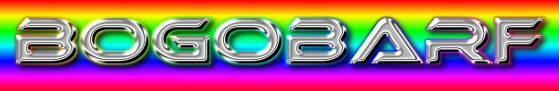

# Introduction

Bogobarf is a framework for robotic software.

Features:
- pub/sub
- service calls
- events
- nodes
- parameters

Bogobarf is a multi-platform multi-programming language robotic software suite.

# Rationale

C/C++ is the wrong language for complex software. The low level nature of C/C++ simply slows down development. Programmers
are too busy implementing linked lists, doing memory management, solving memory leaks. This is unnecessary and a waste of time.
Programmers should worry about actual problems.

Instead of unsafe languages, robotic software should be build with modern languages such as Rust, Go, C#, Scala or Python.
Those languages have a lot in common:

- Large eco system of libraries
- Proper development tooling (dependencies, build, test)
- Modern language features

# Other robot software frameworks

Here is a list of other robotic frameworks:

- ROS: http://www.ros.org/
- yarp: http://yarp.it/
